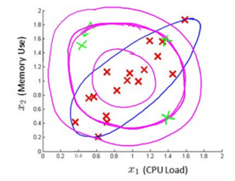
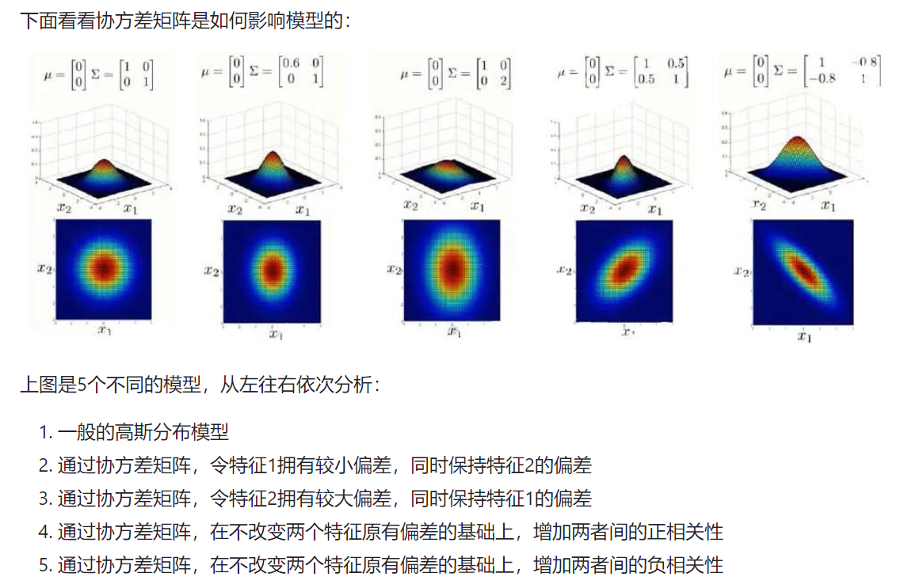
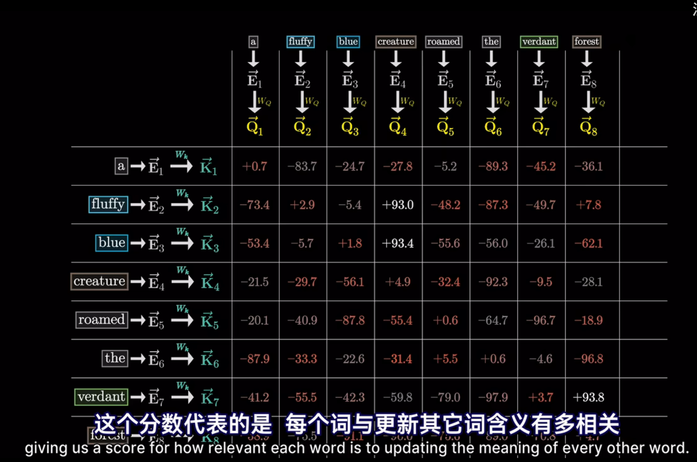

## Reading Note

#### Multivariate Gaussian Normal Distribution

 多元高斯分布

相较于一般的高斯分布模型，只==分别==关注几个特征的偏差，而不考虑其相关性，但是多元高斯分布考虑到了其相关性

比如上面的图中，绿色的点应该被视为异常值，但是在一般的高斯分布中，判定边界是那几个红色圈，反而将异常点包含进来了

在多元高斯分布中，我们通过计算训练数据的协方差，来改变判定边界的形状
$$
x^{(i)} 代表的是其中一个测试样本点数据，一个 m 维列向量 \\
\mu = \frac{1}{m} \sum_{i=1}^{m} x^{(i)}, 是一个向量，每一个维度都是训练集中该维度的平均值\\
\Sigma = \frac{1}{m} \sum_{i = 1}^{m} (x^{(i)} - \mu)(x^{(i)} - \mu)^T = \frac{1}{m}(X-\mu)^T(X-\mu),代表协方差矩阵
$$
然后计算相应的 $p(x)$ 值：
$$
p(x) = \frac{1}{(2\pi)^{\frac{n}{2}} |\Sigma|^{\frac{1}{2}}} exp(-\frac{1}{2}(X-\mu)^T\Sigma^{-1}(X-\mu))
$$
设定好相应的阈值，就可以进行异常检测任务

#### RNN : Recurrent Neural Network 概述

recurrent : 具有周期性的，循环的，这种神经网络应用于序列数据的处理，与传统神经网络不同，该网络具有"记忆能力"，能够捕捉时间序列中的依赖关系：
$$
h_t = f(W_h h_{t -1 } + W_x x_t + b)
$$
其中，$f$ 为激活函数，$b$ 为bias偏置，$W_h,W_{h-1}$ 是权重矩阵，$h_{t-1},h_{t}$ 分别表示前一个时刻和当前状态的隐藏状态（用于记住之前的输入）

RNN的主要缺点：反向传播的时候容易梯度消失

这种针对序列数据的神经网络，可以用于：**预测天气、股票价格；根据视频帧数据判断动作类型；根据上文生成下文** 等

需要注意的是，RNN在==每一个时间步中的 W 参数是相同的==，只不过在向前传播的过程中，总梯度等于所有层梯度的和，由于连乘效应，总梯度被近距离梯度主导，远距离梯度忽略不计，体现了梯度消失，但并非梯度为0

#### Word Embedding

词嵌入是一种将离散的单词、文本数据映射到连续的向量空间的方法，且==相近语义的单词在空间中距离较近==，从而将文本数据转化为计算机可处理的方式，如：
$$
国王-男人+女人=皇后
$$

#### Residual Connection : 残差连接

核心思想在于 : 将输入信息跳跃传输到后面的层，使网络学习的是残差(residual)的信息，而不是直接学习完整的映射函数
$$
y = F(x) + x
$$
其中：$x$ 为输入数据，$F(x)$ 为神经网络中若干层的变换，如卷积、全连接、归一化等，$y$ 为输出

作用有如下几点：

1. 缓解梯度消失问题：残差连接可以直接传输梯度，防止梯度消失
2. 加速网络收敛：相比于普通网络，残差网络能更快的到达较低的损失值
3. 提升特征表达能力：残差连接允许网络保留原始输入特征，同时学习新的特征，从而提高整体特征表达能力

#### Normalization

$$
x' = \frac{x - \mu}{\sigma}
$$

**Batch Normalization** : 在batch维度计算均值和方差

**Layer Normalization **: 对单个样本的所有特征维度计算均值、标准差，如$(2,3,4)$ 经过 $LN$ 后，得到的结果是 $(-\frac{\sqrt{6}}{2},0,\frac{\sqrt{6}}{2})$ 

#### Transformer

以 open-ai 的GPT-3 为例的参数：

$Word \ Embedding: 12288 \times 1$

$Q,K: 128 \times 12288$  因为要保证这三个矩阵可以和嵌入后的词向量相乘，然后计算点积，代表了词之间的相关性

$V: 12288 \times 12288$ ，但是往往进行满秩分解为两个 $12288 \times 128$ 的矩阵

使用了 96 个注意力头，每个注意力头有 96 层

